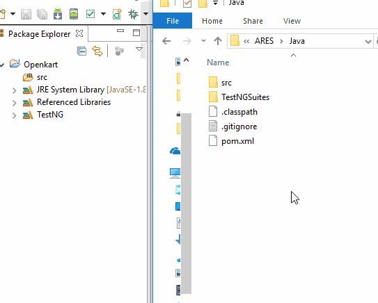
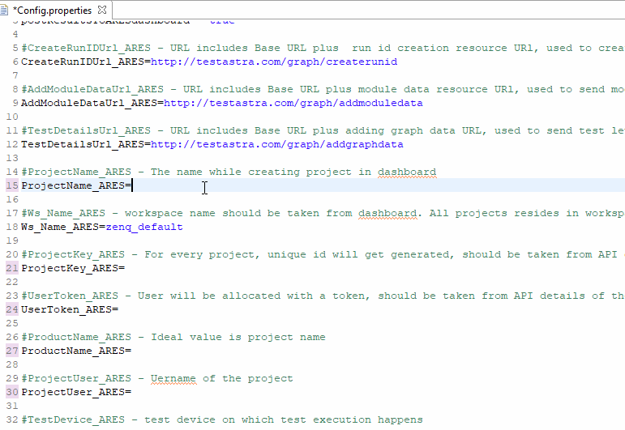

# How to use ARES Dashboard using Selenium Java

In this tutorial will discuss about usage of ARES in Selenium using Java

> Prerequisite: 
> - Basic knowledge on Java, Selenium, TestNG
> - Created project in ARES Dashboard ( create project in ARES is explained in [01_Introduction.md](/Tutorials/01_Introduction.md) )

__SETUP PROJECT__

In this section will discuss about set-up project for ARES dashboard usage

 - Step 1: Copy _USER Token_ and _Project ID_
    > Explained in _GET USER TOKEN AND PROJECT ID_ section of _Introduction_

 - Step 2: Download [Sample Example](https://github.com/testastra/ARES/releases/download/v1.0-java/Java.zip) 

 - Step 3: Copy following folders into project (which contains code to make REST calls and listener for test status):

    > - Copy _Config.properties_ (Folder: Java > src > test > resources > Config.properties)

    > - Copy _listener_ folder (Folder: Java > src > test > java > listener)

    > - Copy _utilities_ folder (Folder: Java > src > test > java > utilities)
 
    > - Copy _ZenQ_Dashboard_ folder (Folder: Java > src > test > java > ZenQ_Dashboard)

    

    > Note: Fix imports of project if any (like adding standalone, testNG jar etc.,)

 - Step 4: Update _Config.properties_ with project info (copied in _Step 1_ )
    > Project Name, Project Key, User Key
    
    

 - Step 5: Write custom test case and include few additional steps of ARES in test case as follows

 - Step 6: Execute test cases

    > Go to *ARES dashboard* to view live execution status of test case

Note: For more usage of REST api calls. Please refer our wiki [link](https://github.com/testastra/ARES/wiki)
